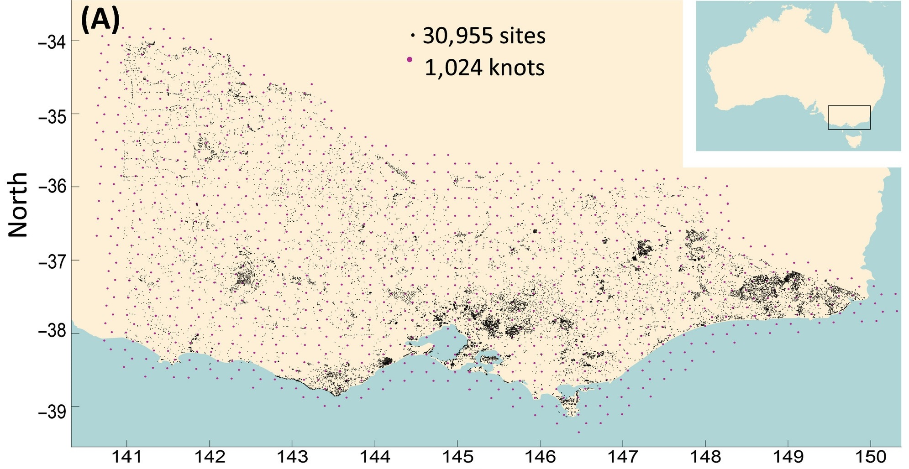
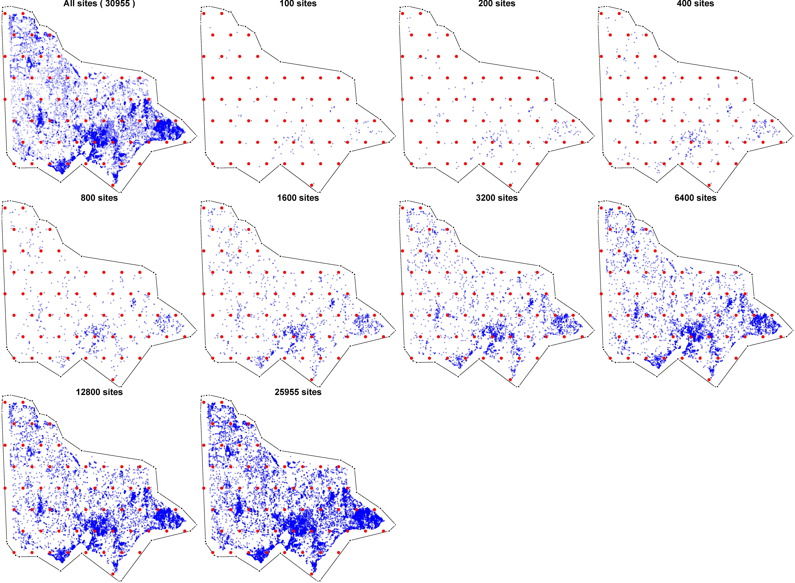
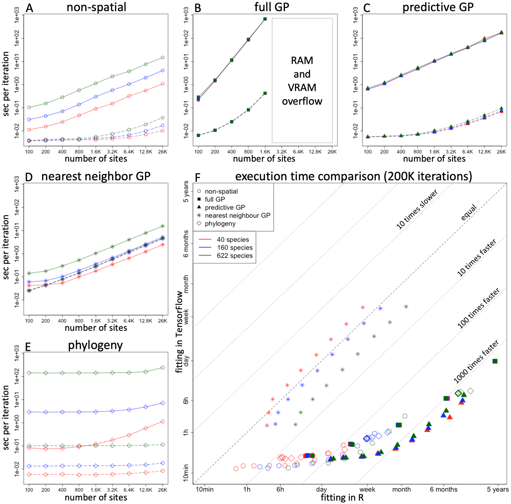

# GPP models

- Data from [Rahman et al. 2024](https://journals.plos.org/ploscompbiol/article?id=10.1371/journal.pcbi.1011914) and [Tikhonov et al. 2020](https://esajournals.onlinelibrary.wiley.com/doi/10.1002/ecy.2929)
- only GPP models
- Number of species: 40-160-622
- Number of sampling units: 100; 200; 400; 800; 1600; 3200; 6400; 12800; 25955
- Study area, GPP, and sampling units

 

The study area, as shown in Tikhonov et al. 2020. The map shows 1,024 knots, only 55 were used in Rahman et al. 2024.

---

## Convergence plots and summary

- [40 species](Hmsc_HPC_Example_40Sp.md)

- [160 species](Hmsc_HPC_Example_160Sp.md)

- [622 species](Hmsc_HPC_Example_622Sp.md)

 

## Sampling units

9 options for the sampling units used in the models.

 

## Results of Rahman et al. 2024

