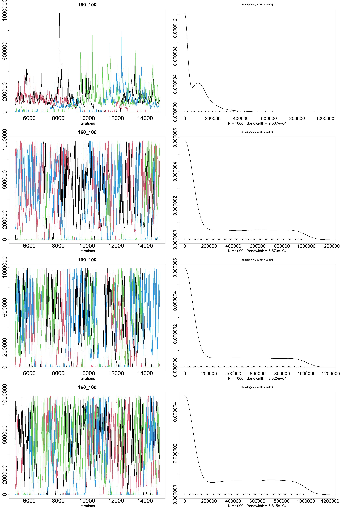
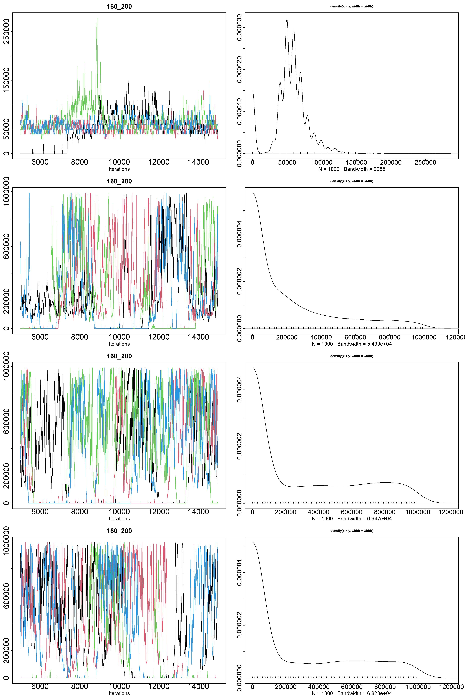
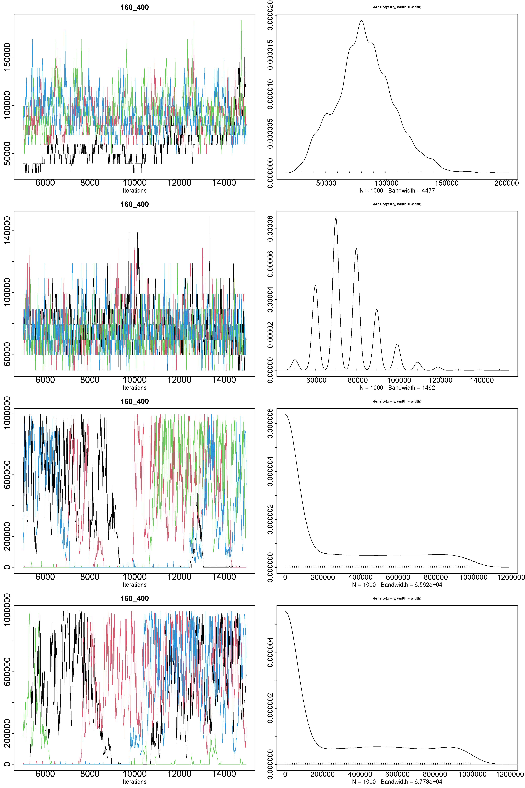
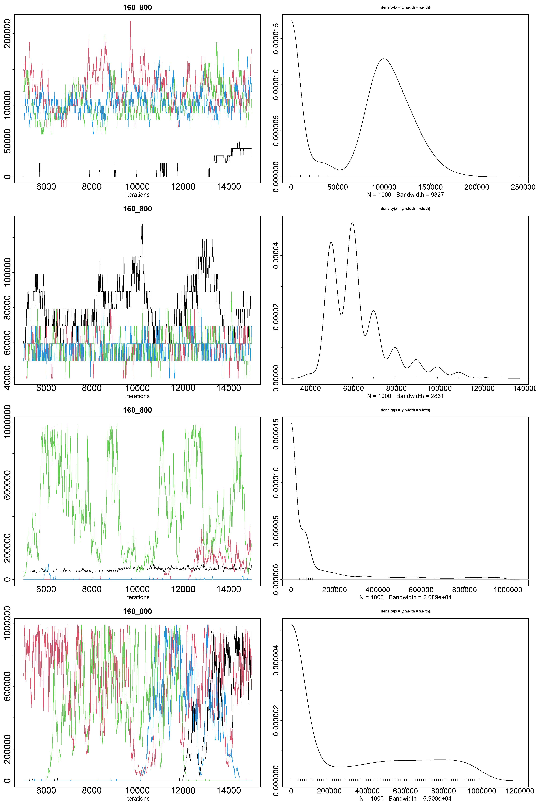
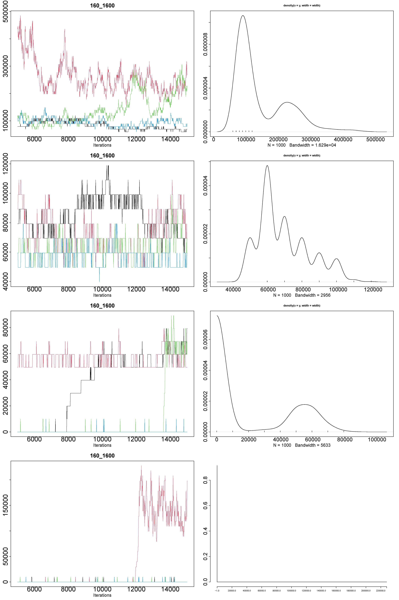
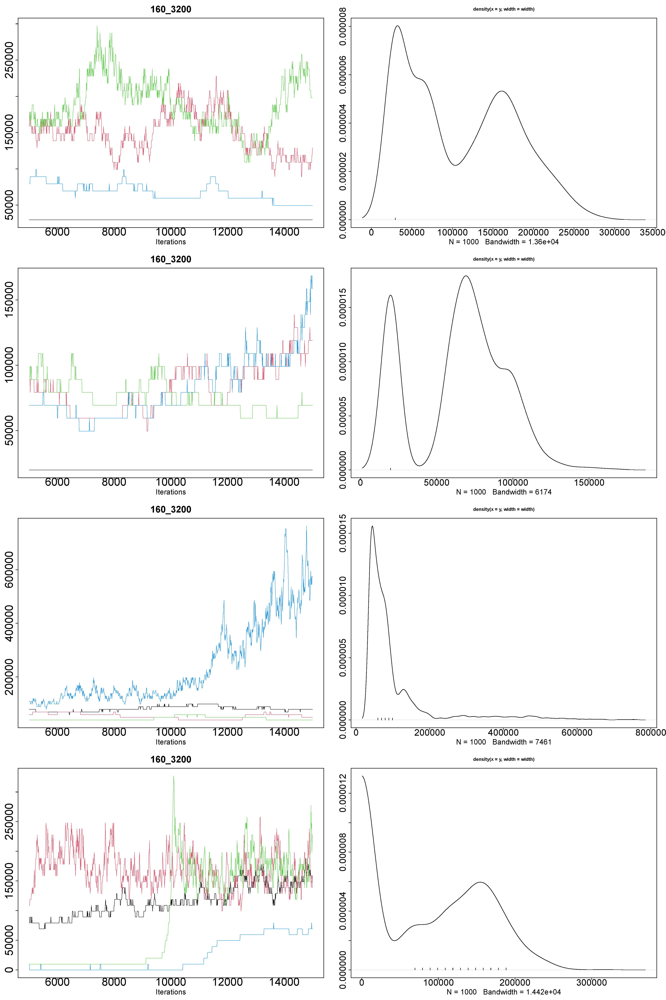
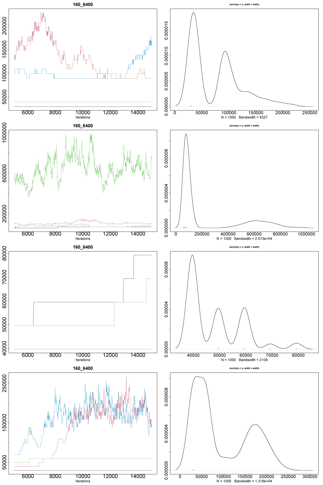
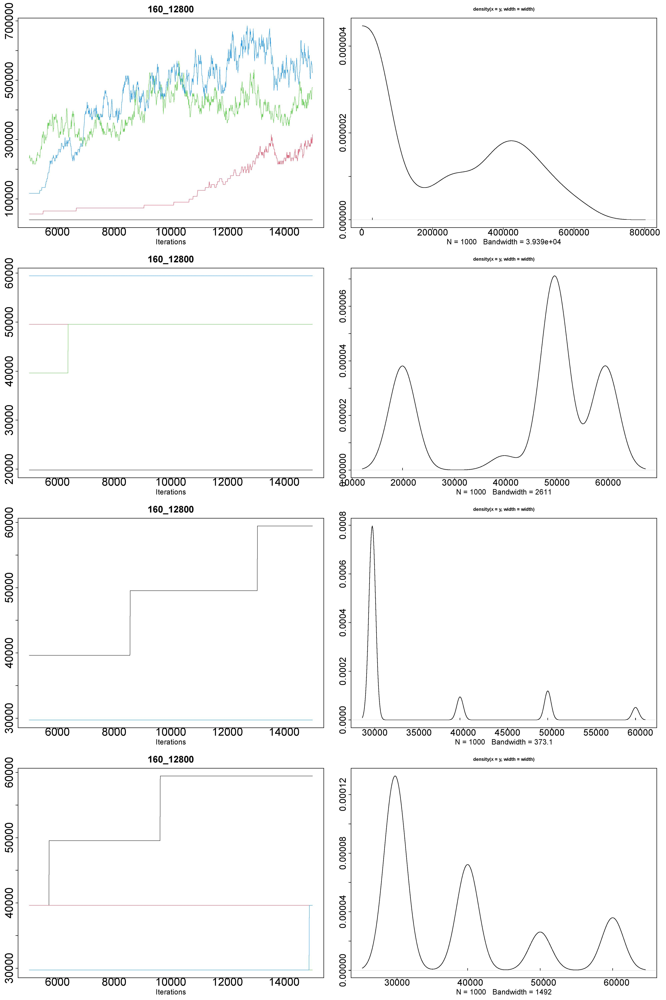
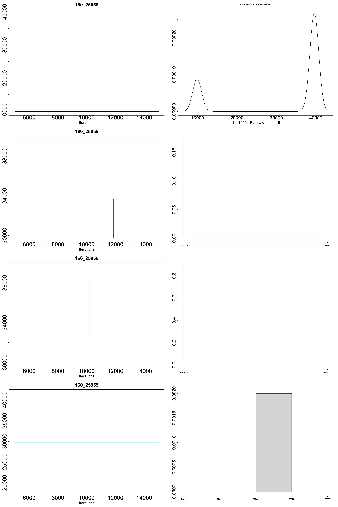

# GPP models - 160 species

## 100 sampling units



```r
Iterations = 5010:15000
Thinning interval = 10
Number of chains = 4
Sample size per chain = 1000

1. Empirical mean and standard deviation for each variable,
   plus standard error of the mean:

                  Mean     SD Naive SE Time-series SE
Alpha1[factor1]  89422  99441     1572          17369
Alpha1[factor2] 281900 330980     5233          31114
Alpha1[factor3] 274959 328332     5191          39537
Alpha1[factor4] 333594 337718     5340          33242

2. Quantiles for each variable:

                2.5% 25%    50%    75%  97.5%
Alpha1[factor1]    0   0  79277 138734 337174
Alpha1[factor2]    0   0 109005 564846 951320
Alpha1[factor3]    0   0  89186 545027 961229
Alpha1[factor4]    0   0 257649 644123 961229
```

## 200 sampling units



```r
Iterations = 5010:15000
Thinning interval = 10
Number of chains = 4
Sample size per chain = 1000

1. Empirical mean and standard deviation for each variable,
   plus standard error of the mean:

                  Mean     SD Naive SE Time-series SE
Alpha1[factor1]  57389  24443    386.5           3714
Alpha1[factor2] 231973 272509   4308.7          32027
Alpha1[factor3] 336542 344255   5443.1          52915
Alpha1[factor4] 314074 338401   5350.6          51074

2. Quantiles for each variable:

                2.5%   25%    50%    75%  97.5%
Alpha1[factor1]    0 49548  59457  69367 109005
Alpha1[factor2]    0     0 138734 366655 921591
Alpha1[factor3]    0     0 247740 654032 971139
Alpha1[factor4]    0     0 188282 614394 961229
```

## 400 sampling units



```r
Iterations = 5010:15000
Thinning interval = 10
Number of chains = 4
Sample size per chain = 1000

1. Empirical mean and standard deviation for each variable,
   plus standard error of the mean:

                  Mean     SD Naive SE Time-series SE
Alpha1[factor1]  82529  24063    380.5         1824.3
Alpha1[factor2]  75142  13227    209.1          430.5
Alpha1[factor3] 258660 325200   5141.9        72763.1
Alpha1[factor4] 300181 335890   5310.9        51959.9

2. Quantiles for each variable:

                 2.5%   25%    50%    75%  97.5%
Alpha1[factor1] 39638 69367  79277  99096 138734
Alpha1[factor2] 59457 69367  69367  79277 109005
Alpha1[factor3]     0     0  19819 525208 951320
Alpha1[factor4]     0     0 158553 584665 961229
```

## 800 sampling units



```r
Iterations = 5010:15000
Thinning interval = 10
Number of chains = 4
Sample size per chain = 1000

1. Empirical mean and standard deviation for each variable,
   plus standard error of the mean:

                  Mean     SD Naive SE Time-series SE
Alpha1[factor1]  83176  48940    773.8         2344.2
Alpha1[factor2]  62334  14028    221.8          792.2
Alpha1[factor3] 136492 228044   3605.7        19796.3
Alpha1[factor4] 320825 342346   5413.0        64132.3

2. Quantiles for each variable:

                 2.5%   25%    50%    75%  97.5%
Alpha1[factor1]     0 56980  99096 118915 158553
Alpha1[factor2] 49548 49548  59457  69367  99096
Alpha1[factor3]     0     0  59457 138734 881953
Alpha1[factor4]     0     0 188282 634213 951320
```

## 1,600 sampling units



```r
Iterations = 5010:15000
Thinning interval = 10
Number of chains = 4
Sample size per chain = 1000

1. Empirical mean and standard deviation for each variable,
   plus standard error of the mean:

                  Mean    SD Naive SE Time-series SE
Alpha1[factor1] 143897 80720   1276.3           7717
Alpha1[factor2]  68728 14649    231.6           1494
Alpha1[factor3]  25188 27913    441.3           5748
Alpha1[factor4]  10512 37668    595.6          11101

2. Quantiles for each variable:

                 2.5%   25%    50%    75%  97.5%
Alpha1[factor1] 69367 89186 109005 208101 346835
Alpha1[factor2] 49548 59457  69367  79277  99096
Alpha1[factor3]     0     0      0  49548  69367
Alpha1[factor4]     0     0      0      0 148644
```

## 3,200 sampling units



```r
Iterations = 5010:15000
Thinning interval = 10
Number of chains = 4
Sample size per chain = 1000

1. Empirical mean and standard deviation for each variable,
   plus standard error of the mean:

                  Mean     SD Naive SE Time-series SE
Alpha1[factor1] 108621  67375   1065.3           4237
Alpha1[factor2]  64975  30597    483.8           3724
Alpha1[factor3] 104534 109751   1735.3          15692
Alpha1[factor4] 100401  71468   1130.0          14366

2. Quantiles for each variable:

                 2.5%   25%    50%    75%  97.5%
Alpha1[factor1] 29729 44593  99096 168463 237830
Alpha1[factor2] 19819 42116  69367  89186 118915
Alpha1[factor3] 39638 49548  69367  99096 475908
Alpha1[factor4]     0  9910 109005 158553 218011
```

## 6,400 sampling units



```r
Iterations = 5010:15000
Thinning interval = 10
Number of chains = 4
Sample size per chain = 1000

1. Empirical mean and standard deviation for each variable,
   plus standard error of the mean:

                  Mean     SD Naive SE Time-series SE
Alpha1[factor1]  75147  46839    740.6           8016
Alpha1[factor2] 223828 250123   3954.8           7181
Alpha1[factor3]  48317  10453    165.3           1402
Alpha1[factor4]  95585  65306   1032.6          12975

2. Quantiles for each variable:

                 2.5%   25%   50%    75%  97.5%
Alpha1[factor1] 29729 37161 64412  99096 188282
Alpha1[factor2] 59457 69367 89186 203146 792767
Alpha1[factor3] 39638 39638 44593  59457  79277
Alpha1[factor4] 29729 37161 59457 158553 218011
```

## 12,800 sampling units



```r
Iterations = 5010:15000
Thinning interval = 10
Number of chains = 4
Sample size per chain = 1000

1. Empirical mean and standard deviation for each variable,
   plus standard error of the mean:

                  Mean     SD Naive SE Time-series SE
Alpha1[factor1] 249927 195223   3086.7        20965.2
Alpha1[factor2]  44254  14862    235.0          440.7
Alpha1[factor3]  34285   8671    137.1         1292.5
Alpha1[factor4]  38350  10470    165.6          915.1

2. Quantiles for each variable:

                 2.5%   25%    50%    75%  97.5%
Alpha1[factor1] 29729 44593 247740 426112 604484
Alpha1[factor2] 19819 34684  49548  52025  59457
Alpha1[factor3] 29729 29729  29729  32206  59457
Alpha1[factor4] 29729 29729  39638  39638  59457
```

## 25,955 sampling units



```r
Iterations = 5010:15000
Thinning interval = 10
Number of chains = 4
Sample size per chain = 1000

1. Empirical mean and standard deviation for each variable,
   plus standard error of the mean:

                 Mean    SD Naive SE Time-series SE
Alpha1[factor1] 32206 12875   203.56            0.0
Alpha1[factor2] 37936  3738    59.10          850.4
Alpha1[factor3] 30913  3215    50.83         1009.4
Alpha1[factor4] 29729     0     0.00            0.0

2. Quantiles for each variable:

                 2.5%   25%   50%   75% 97.5%
Alpha1[factor1]  9910 32206 39638 39638 39638
Alpha1[factor2] 29729 39638 39638 39638 39638
Alpha1[factor3] 29729 29729 29729 29729 39638
Alpha1[factor4] 29729 29729 29729 29729 29729
```
