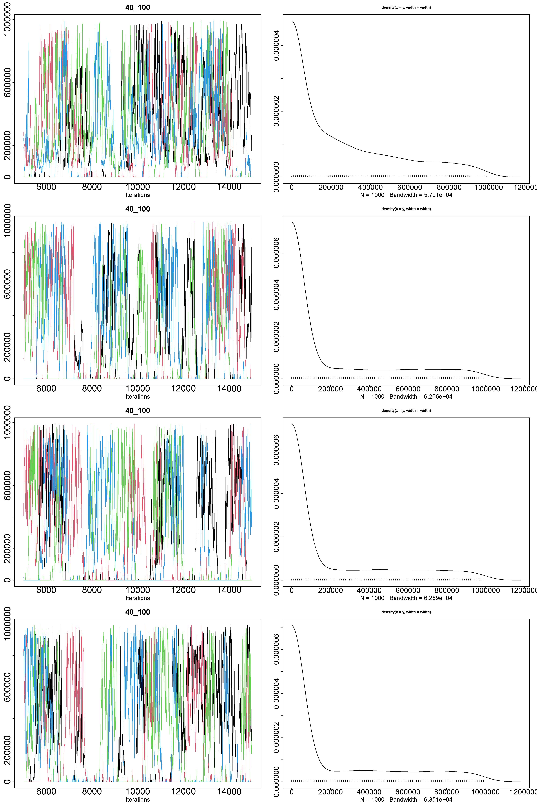
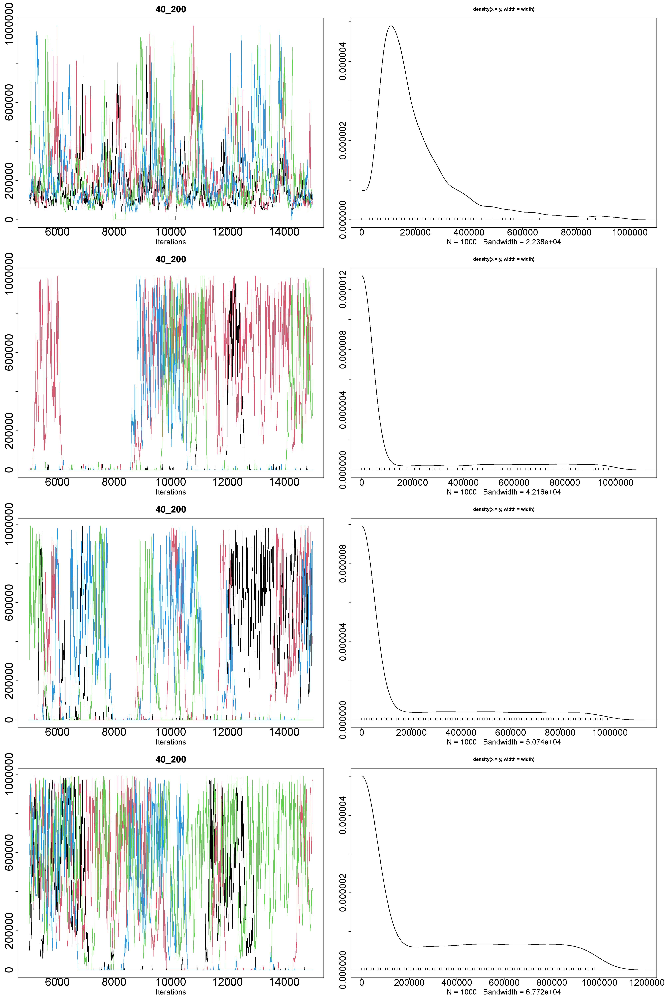
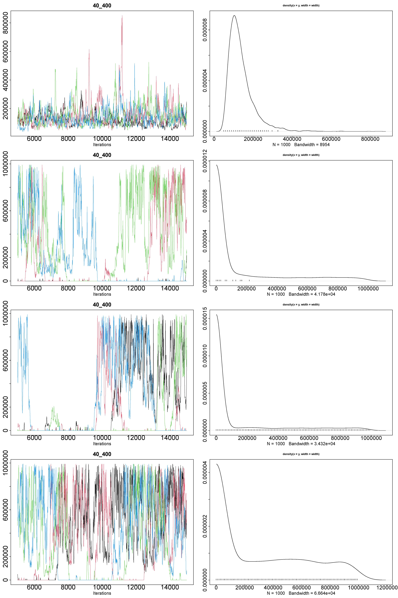
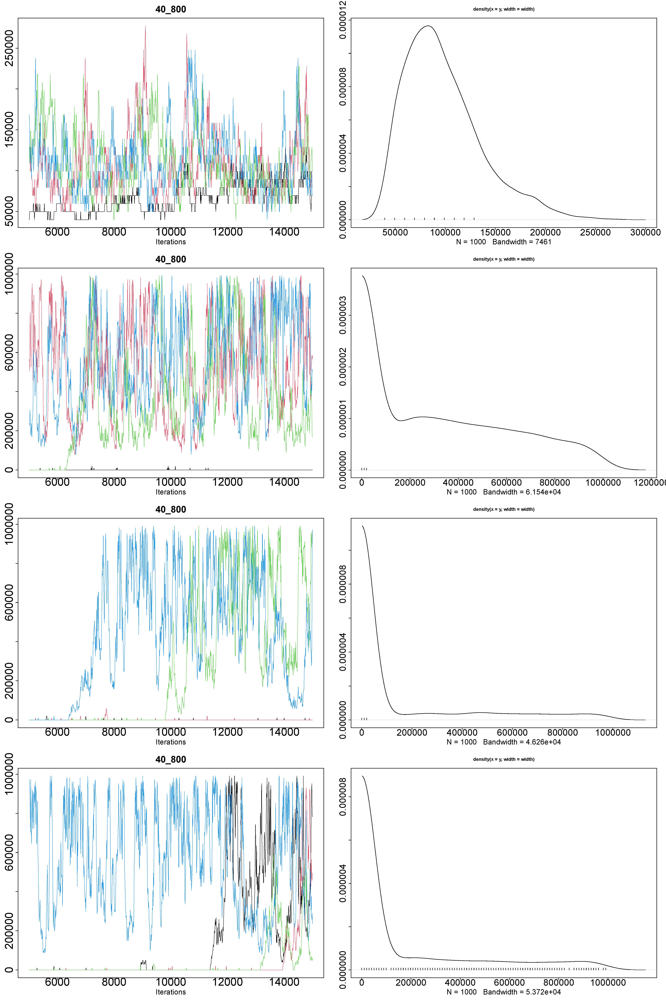
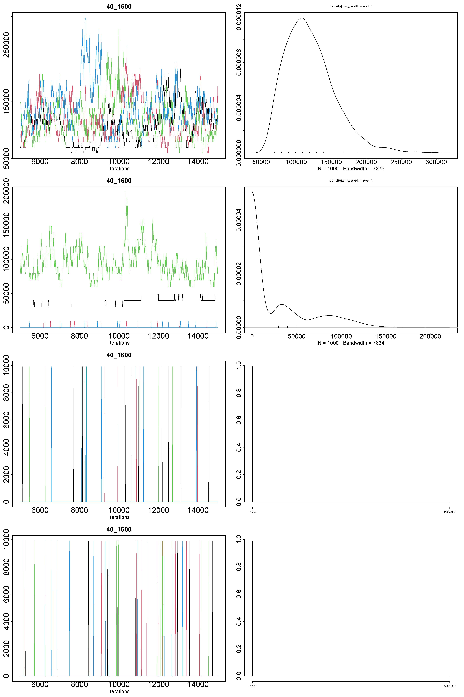
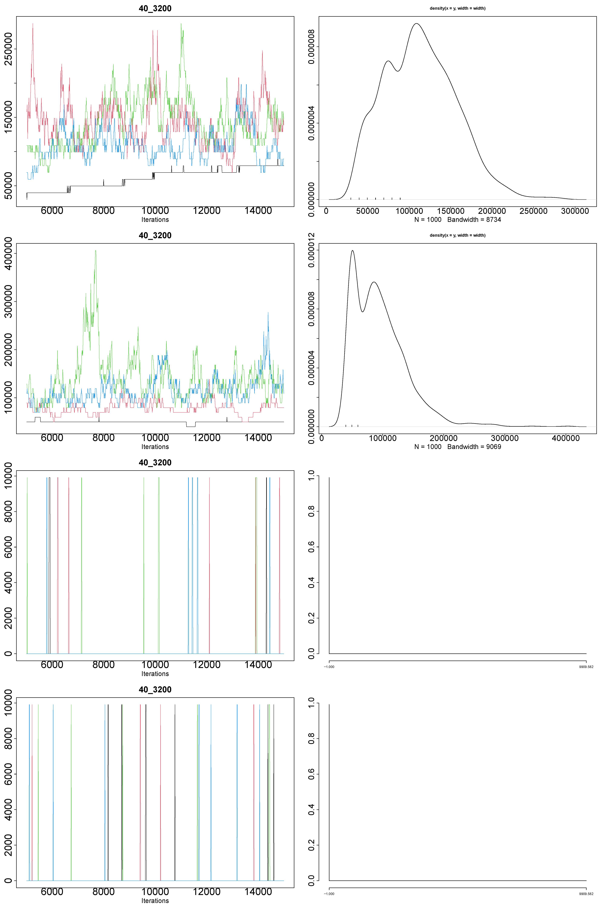
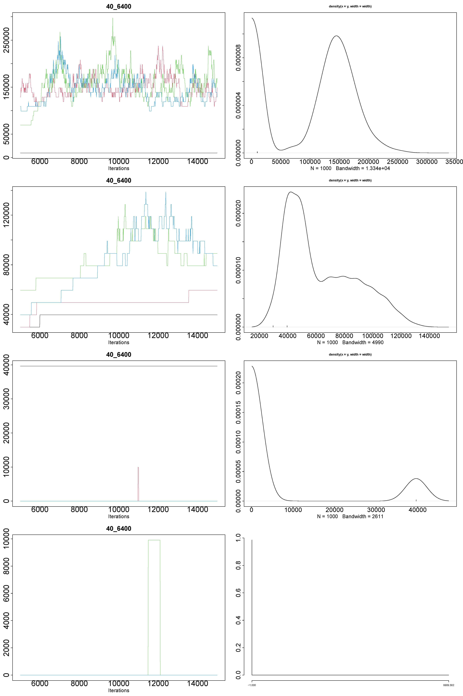
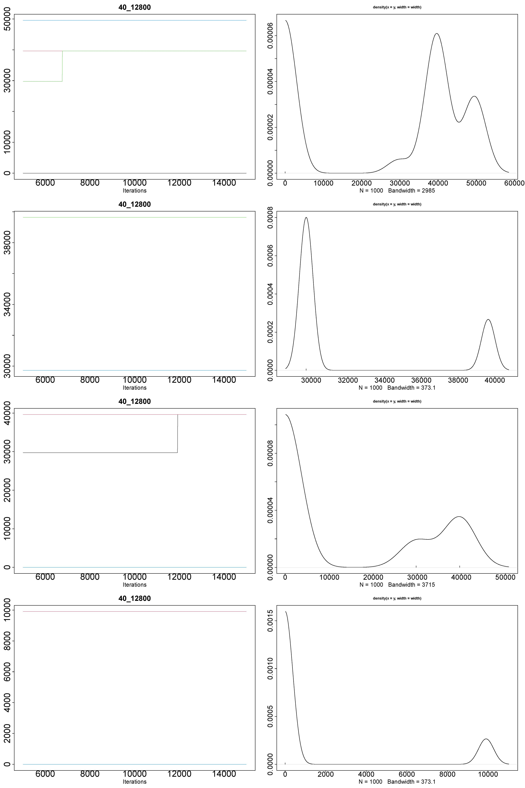
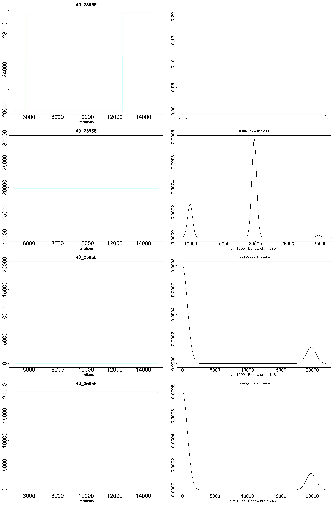

# Results for GPP models - 40 species at different numbers of sampling units

## 100 sampling units



```r
Iterations = 5010:15000
Thinning interval = 10
Number of chains = 4
Sample size per chain = 1000

1. Empirical mean and standard deviation for each variable,
   plus standard error of the mean:

                  Mean     SD Naive SE Time-series SE
Alpha1[factor1] 273988 282525     4467          25857
Alpha1[factor2] 219485 310458     4909          30674
Alpha1[factor3] 228019 311649     4928          35347
Alpha1[factor4] 233299 314748     4977          34980

2. Quantiles for each variable:

                2.5% 25%    50%    75%  97.5%
Alpha1[factor1]    0   0 188282 455841 911682
Alpha1[factor2]    0   0      0 426112 931501
Alpha1[factor3]    0   0      0 445931 941410
Alpha1[factor4]    0   0      0 455841 941410
```

## 200 sampling units



```r
Iterations = 5010:15000
Thinning interval = 10
Number of chains = 4
Sample size per chain = 1000

1. Empirical mean and standard deviation for each variable,
   plus standard error of the mean:

                  Mean     SD Naive SE Time-series SE
Alpha1[factor1] 206070 161613     2555           8831
Alpha1[factor2] 176566 298773     4724          47611
Alpha1[factor3] 187083 292197     4620          41618
Alpha1[factor4] 321075 335608     5306          48046

2. Quantiles for each variable:

                 2.5%   25%    50%    75%  97.5%
Alpha1[factor1] 49548 99096 158553 247740 693671
Alpha1[factor2]     0     0      0 279946 921591
Alpha1[factor3]     0     0      0 336926 911682
Alpha1[factor4]     0     0 227920 614394 961229
```

## 400 sampling units



```r
Iterations = 5010:15000
Thinning interval = 10
Number of chains = 4
Sample size per chain = 1000

1. Empirical mean and standard deviation for each variable,
   plus standard error of the mean:

                  Mean     SD Naive SE Time-series SE
Alpha1[factor1] 138075  68279     1080           3972
Alpha1[factor2] 179980 286355     4528          39207
Alpha1[factor3] 163887 284191     4493          56619
Alpha1[factor4] 348654 330227     5221          49319

2. Quantiles for each variable:

                 2.5%   25%    50%    75%  97.5%
Alpha1[factor1] 59457 99096 118915 158553 307445
Alpha1[factor2]     0     0      0 277468 911682
Alpha1[factor3]     0     0      0 227920 911929
Alpha1[factor4]     0     0 297287 624304 961229
```

## 800 sampling units



```r
Iterations = 5010:15000
Thinning interval = 10
Number of chains = 4
Sample size per chain = 1000

1. Empirical mean and standard deviation for each variable,
   plus standard error of the mean:

                  Mean     SD Naive SE Time-series SE
Alpha1[factor1]  98179  38473    608.3           2944
Alpha1[factor2] 352984 304980   4822.2          20526
Alpha1[factor3] 178697 293078   4634.0          35574
Alpha1[factor4] 200513 299231   4731.3          31234

2. Quantiles for each variable:

                 2.5%   25%    50%    75%  97.5%
Alpha1[factor1] 49548 69367  89186 118915 188282
Alpha1[factor2]     0     0 317107 594575 951320
Alpha1[factor3]     0     0      0 307197 921591
Alpha1[factor4]     0     0      0 356745 931501
```

## 1,600 sampling units



```r
Iterations = 5010:15000
Thinning interval = 10
Number of chains = 4
Sample size per chain = 1000

1. Empirical mean and standard deviation for each variable,
   plus standard error of the mean:

                     Mean      SD Naive SE Time-series SE
Alpha1[factor1] 120307.28 36058.6   570.14        3412.99
Alpha1[factor2]  32741.26 40102.2   634.07        1290.60
Alpha1[factor3]     69.37   826.3    13.06          13.49
Alpha1[factor4]    104.05  1010.2    15.97          16.86

2. Quantiles for each variable:

                 2.5%   25%    50%    75%  97.5%
Alpha1[factor1] 69367 89186 118915 138734 208101
Alpha1[factor2]     0     0  19819  52025 118915
Alpha1[factor3]     0     0      0      0      0
Alpha1[factor4]     0     0      0      0      0
```

## 3,200 sampling units



```r
Iterations = 5010:15000
Thinning interval = 10
Number of chains = 4
Sample size per chain = 1000

1. Empirical mean and standard deviation for each variable,
   plus standard error of the mean:

                     Mean    SD Naive SE Time-series SE
Alpha1[factor1] 113484.53 43286   684.41        3990.37
Alpha1[factor2]  95419.36 44942   710.60        3164.14
Alpha1[factor3]    104.05  1010    15.97          33.14
Alpha1[factor4]     86.71   923    14.59          19.89

2. Quantiles for each variable:

                 2.5%   25%    50%    75%  97.5%
Alpha1[factor1] 39638 79277 109005 138734 208101
Alpha1[factor2] 49548 49548  89186 118915 198192
Alpha1[factor3]     0     0      0      0      0
Alpha1[factor4]     0     0      0      0      0
```

## 6,400 sampling units



```r
Iterations = 5010:15000
Thinning interval = 10
Number of chains = 4
Sample size per chain = 1000

1. Empirical mean and standard deviation for each variable,
   plus standard error of the mean:

                    Mean    SD Naive SE Time-series SE
Alpha1[factor1] 114678.6 66098   1045.1        3432.43
Alpha1[factor2]  63574.9 24730    391.0        4318.16
Alpha1[factor3]   9919.5 17163    271.4          10.18
Alpha1[factor4]    151.1  1215     19.2         199.63

2. Quantiles for each variable:

                 2.5%   25%    50%    75%  97.5%
Alpha1[factor1]  9910 54503 138734 158553 218011
Alpha1[factor2] 29729 39638  49548  79277 118915
Alpha1[factor3]     0     0      0  17342  39638
Alpha1[factor4]     0     0      0      0      0
```

## 12,800 sampling units



```r
Iterations = 5010:15000
Thinning interval = 10
Number of chains = 4
Sample size per chain = 1000

1. Empirical mean and standard deviation for each variable,
   plus standard error of the mean:

                 Mean    SD Naive SE Time-series SE
Alpha1[factor1] 31770 18970   299.94          549.2
Alpha1[factor2] 32206  4292    67.85            0.0
Alpha1[factor3] 18105 18411   291.11          841.9
Alpha1[factor4]  2477  4292    67.85            0.0

2. Quantiles for each variable:

                 2.5%   25%   50%   75% 97.5%
Alpha1[factor1]     0 22297 39638 42116 49548
Alpha1[factor2] 29729 29729 29729 32206 39638
Alpha1[factor3]     0     0 14864 39638 39638
Alpha1[factor4]     0     0     0  2477  9910
```

## 25,955 sampling units



```r
Iterations = 5010:15000
Thinning interval = 10
Number of chains = 4
Sample size per chain = 1000

1. Empirical mean and standard deviation for each variable,
   plus standard error of the mean:

                 Mean   SD Naive SE Time-series SE
Alpha1[factor1] 27668 4023     63.6          762.7
Alpha1[factor2] 17495 4547     71.9          209.3
Alpha1[factor3]  4955 8583    135.7            0.0
Alpha1[factor4]  4955 8583    135.7            0.0

2. Quantiles for each variable:

                 2.5%   25%   50%   75% 97.5%
Alpha1[factor1] 19819 29729 29729 29729 29729
Alpha1[factor2]  9910 17342 19819 19819 19819
Alpha1[factor3]     0     0     0  4955 19819
Alpha1[factor4]     0     0     0  4955 19819
```
