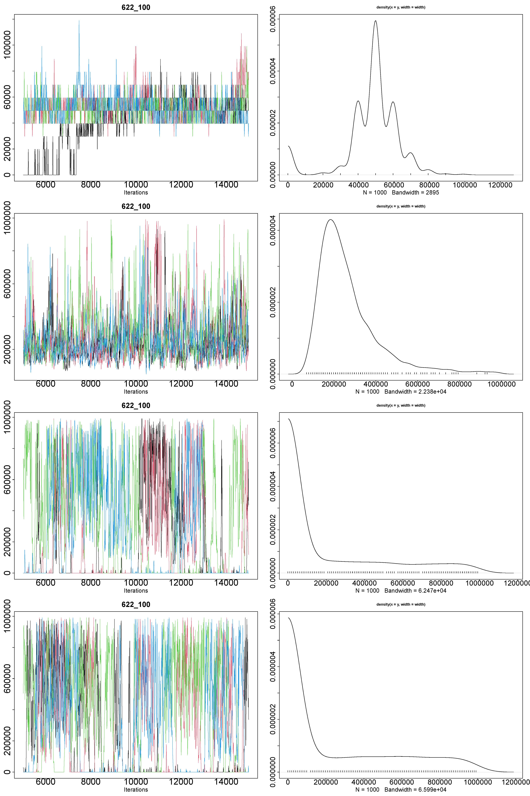
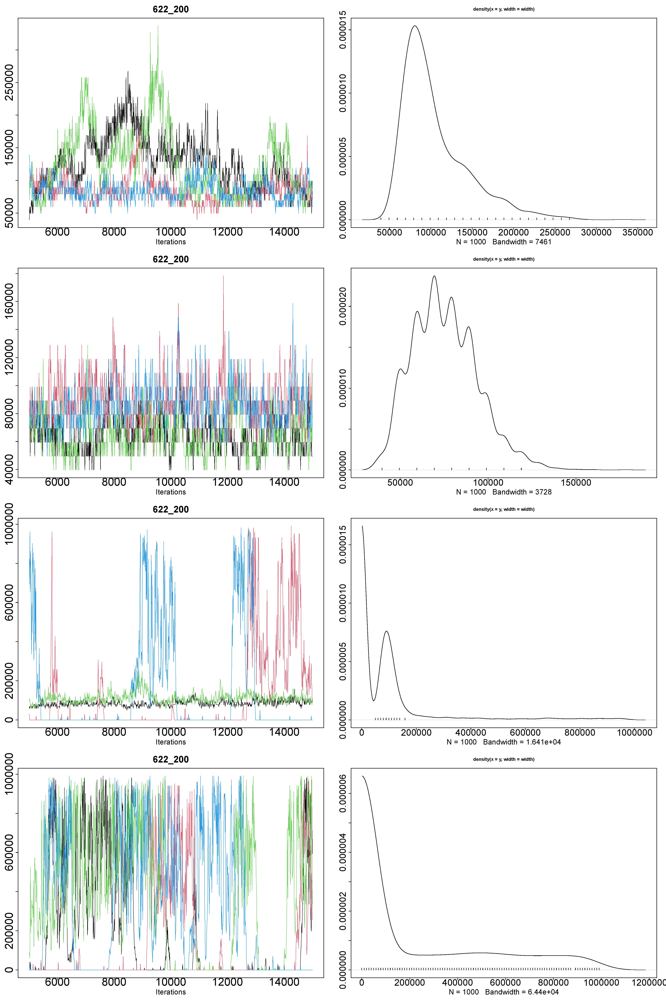
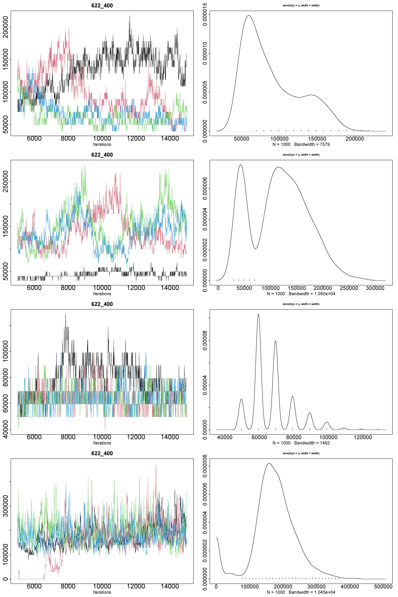
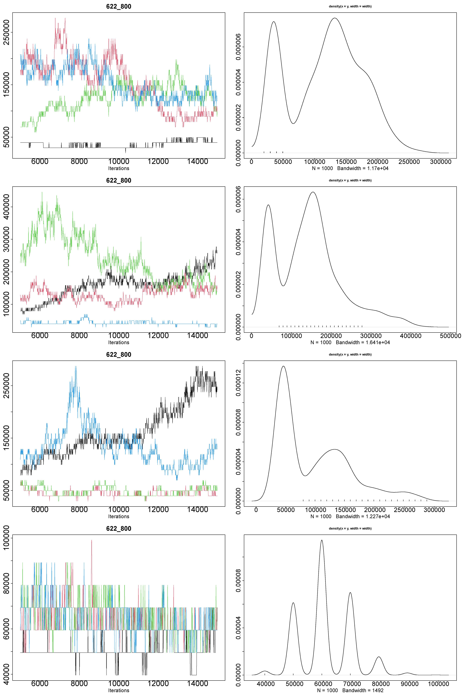
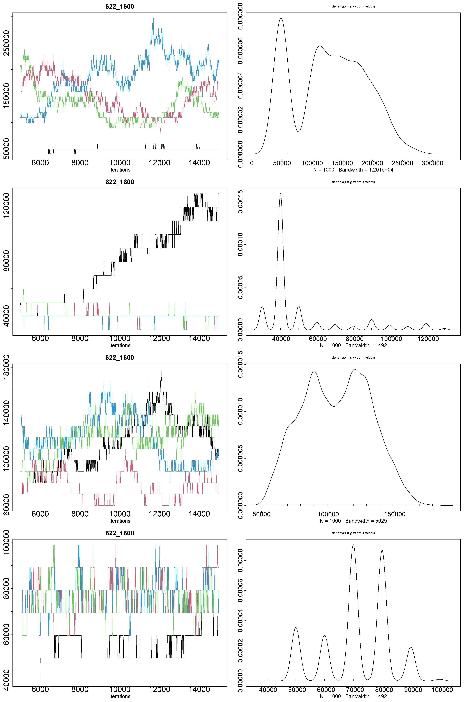
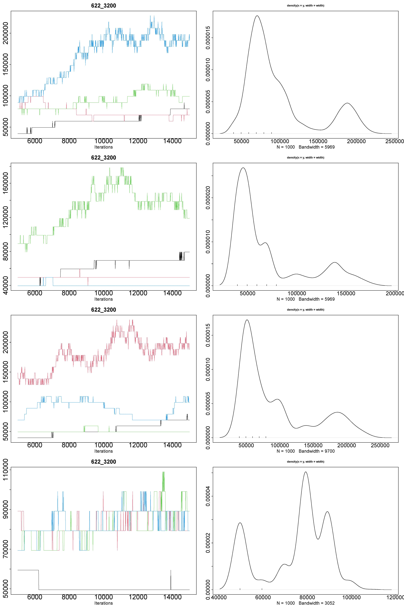
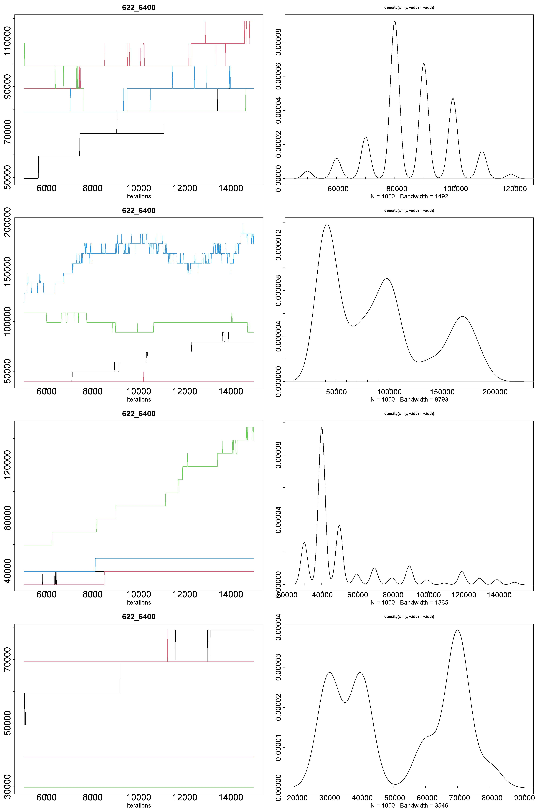
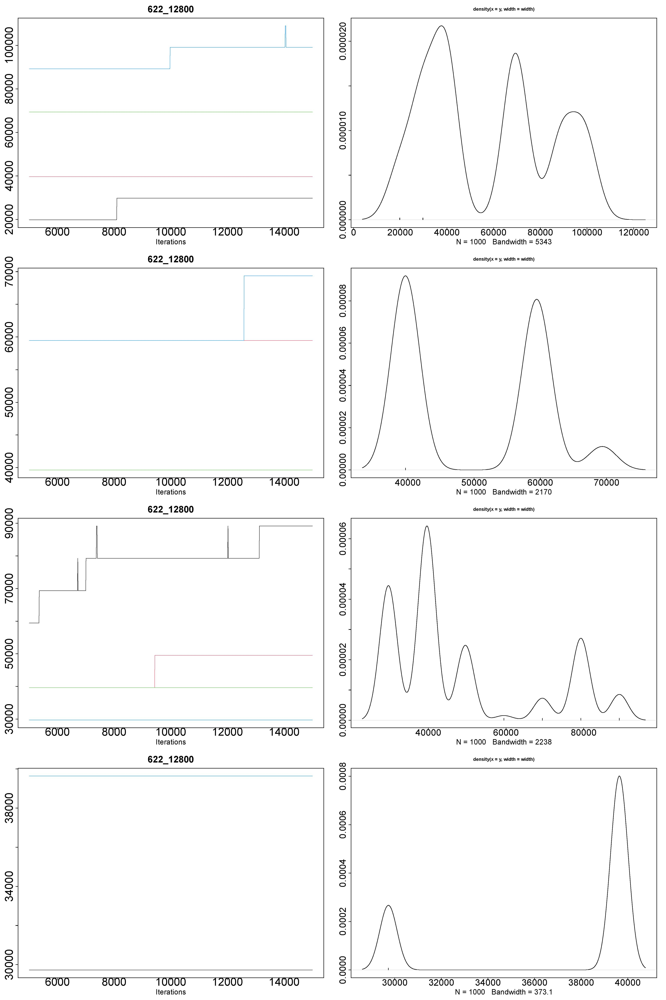
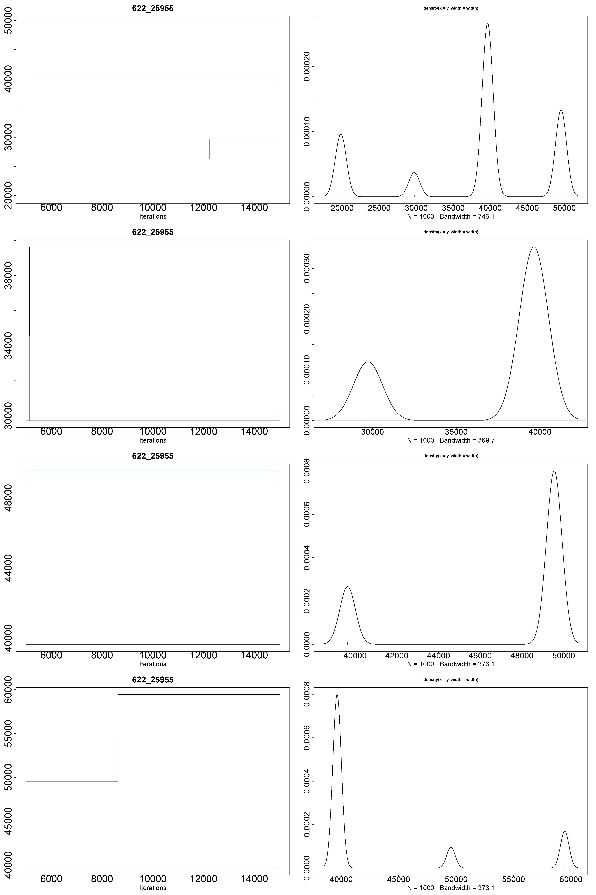

# Results for GPP models - 622 species at different numbers sampling units

## 100 sampling units



```r
Iterations = 5010:15000
Thinning interval = 10
Number of chains = 4
Sample size per chain = 1000

1. Empirical mean and standard deviation for each variable,
   plus standard error of the mean:

                  Mean     SD Naive SE Time-series SE
Alpha1[factor1]  48750  14345    226.8           2114
Alpha1[factor2] 267140 147545   2332.9           6501
Alpha1[factor3] 227338 309586   4895.0          36475
Alpha1[factor4] 280302 327043   5171.0          35441

2. Quantiles for each variable:

                 2.5%    25%    50%    75%  97.5%
Alpha1[factor1]     0  39638  49548  59457  69367
Alpha1[factor2] 99096 168463 227920 317107 693671
Alpha1[factor3]     0      0      0 428589 941410
Alpha1[factor4]     0      0 109005 554937 951320
```

## 200 sampling units



```r
Iterations = 5010:15000
Thinning interval = 10
Number of chains = 4
Sample size per chain = 1000

1. Empirical mean and standard deviation for each variable,
   plus standard error of the mean:

                  Mean     SD Naive SE Time-series SE
Alpha1[factor1] 105544  40533    640.9         6182.0
Alpha1[factor2]  75526  18476    292.1          721.7
Alpha1[factor3] 113693 177575   2807.7        27622.9
Alpha1[factor4] 252201 319171   5046.5        42685.9

2. Quantiles for each variable:

                 2.5%   25%   50%    75%  97.5%
Alpha1[factor1] 59457 79277 89186 128825 218011
Alpha1[factor2] 49548 59457 69367  89186 118915
Alpha1[factor3]     0     0 79277 109005 773195
Alpha1[factor4]     0     0 19819 495479 941410
```

## 400 sampling units



```r
Iterations = 5010:15000
Thinning interval = 10
Number of chains = 4
Sample size per chain = 1000

1. Empirical mean and standard deviation for each variable,
   plus standard error of the mean:

                  Mean    SD Naive SE Time-series SE
Alpha1[factor1]  90095 37561    593.9           5329
Alpha1[factor2] 116564 54139    856.0           5549
Alpha1[factor3]  66860 12090    191.2           1053
Alpha1[factor4] 174820 63764   1008.2           8291

2. Quantiles for each variable:

                 2.5%    25%    50%    75%  97.5%
Alpha1[factor1] 39638  59457  79277 118915 168463
Alpha1[factor2] 39638  69367 118915 158553 218011
Alpha1[factor3] 49548  59457  69367  69367  99096
Alpha1[factor4]     0 138734 168463 208101 307197
```

## 800 sampling units



```r
Iterations = 5010:15000
Thinning interval = 10
Number of chains = 4
Sample size per chain = 1000

1. Empirical mean and standard deviation for each variable,
   plus standard error of the mean:

                  Mean    SD Naive SE Time-series SE
Alpha1[factor1] 116893 57958    916.4         7879.1
Alpha1[factor2] 143149 82490   1304.3        10132.5
Alpha1[factor3]  97443 60797    961.3         9725.4
Alpha1[factor4]  60904  9014    142.5          567.7

2. Quantiles for each variable:

                 2.5%   25%    50%    75%  97.5%
Alpha1[factor1] 29729 56980 128825 158553 218011
Alpha1[factor2] 39638 69367 138734 178372 346835
Alpha1[factor3] 39638 49548  69367 138734 247740
Alpha1[factor4] 49548 59457  59457  69367  79277
```

## 1,600 sampling units



```r
Iterations = 5010:15000
Thinning interval = 10
Number of chains = 4
Sample size per chain = 1000

1. Empirical mean and standard deviation for each variable,
   plus standard error of the mean:

                  Mean    SD Naive SE Time-series SE
Alpha1[factor1] 129280 59513    941.0         8609.1
Alpha1[factor2]  49144 21970    347.4         5572.7
Alpha1[factor3] 106251 24924    394.1         4678.0
Alpha1[factor4]  70608 11436    180.8          842.5

2. Quantiles for each variable:

                 2.5%   25%    50%    75%  97.5%
Alpha1[factor1] 39638 74322 128825 178372 237830
Alpha1[factor2] 29729 39638  39638  49548 118915
Alpha1[factor3] 59457 89186 109005 128825 148644
Alpha1[factor4] 49548 69367  69367  79277  89186
```

## 3,200 sampling units



```r
Iterations = 5010:15000
Thinning interval = 10
Number of chains = 4
Sample size per chain = 1000

1. Empirical mean and standard deviation for each variable,
   plus standard error of the mean:

                 Mean    SD Naive SE Time-series SE
Alpha1[factor1] 97956 44919    710.2         6907.8
Alpha1[factor2] 70482 37883    599.0         4052.2
Alpha1[factor3] 92793 54074    855.0         4302.8
Alpha1[factor4] 74485 15124    239.1          967.6

2. Quantiles for each variable:

                 2.5%   25%   50%    75%  97.5%
Alpha1[factor1] 49548 69367 79277 109005 198192
Alpha1[factor2] 39638 39638 49548  79277 158553
Alpha1[factor3] 39638 49548 69367 113960 208101
Alpha1[factor4] 49548 66890 79277  89186  99096
```

## 6,400 sampling units



```r
Iterations = 5010:15000
Thinning interval = 10
Number of chains = 4
Sample size per chain = 1000

1. Empirical mean and standard deviation for each variable,
   plus standard error of the mean:

                 Mean    SD Naive SE Time-series SE
Alpha1[factor1] 85210 12995    205.5           2745
Alpha1[factor2] 90764 48530    767.3           3878
Alpha1[factor3] 53650 27053    427.7           4880
Alpha1[factor4] 51463 17572    277.8           1395

2. Quantiles for each variable:

                 2.5%   25%   50%    75%  97.5%
Alpha1[factor1] 59457 79277 89186  89186 109005
Alpha1[factor2] 39638 39638 89186 111483 178372
Alpha1[factor3] 29729 39638 39638  52025 128825
Alpha1[factor4] 29729 37161 44593  69367  79277
```

## 12,800 sampling units



```r
Iterations = 5010:15000
Thinning interval = 10
Number of chains = 4
Sample size per chain = 1000

1. Empirical mean and standard deviation for each variable,
   plus standard error of the mean:

                 Mean    SD Naive SE Time-series SE
Alpha1[factor1] 57468 26478   418.65         1294.3
Alpha1[factor2] 50147 10756   170.07          711.1
Alpha1[factor3] 48346 18953   299.67         1291.7
Alpha1[factor4] 37161  4292    67.85            0.0

2. Quantiles for each variable:

                 2.5%   25%   50%   75% 97.5%
Alpha1[factor1] 19819 37161 54503 74322 99096
Alpha1[factor2] 39638 39638 49548 59457 69367
Alpha1[factor3] 29729 37161 39638 52025 89186
Alpha1[factor4] 29729 37161 39638 39638 39638
```

## 25,955 sampling units



```r
Iterations = 5010:15000
Thinning interval = 10
Number of chains = 4
Sample size per chain = 1000

1. Empirical mean and standard deviation for each variable,
   plus standard error of the mean:

                 Mean   SD Naive SE Time-series SE
Alpha1[factor1] 37850 9955   157.40         786.58
Alpha1[factor2] 37129 4310    68.15          37.08
Alpha1[factor3] 47071 4292    67.85           0.00
Alpha1[factor4] 43696 7422   117.35         922.86

2. Quantiles for each variable:

                 2.5%   25%   50%   75% 97.5%
Alpha1[factor1] 19819 37161 39638 42116 49548
Alpha1[factor2] 29729 29729 39638 39638 39638
Alpha1[factor3] 39638 47071 49548 49548 49548
Alpha1[factor4] 39638 39638 39638 42116 59457
```
